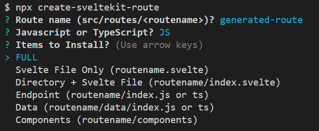
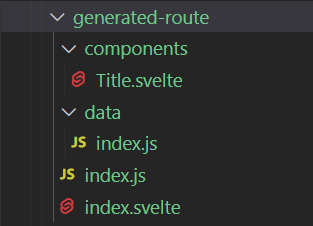

# Welcome to create-sveltekit-auth0 👋
[](https://www.npmjs.com/package/create-sveltekit-auth0)
[](https://github.com/lcharleslaing/create-sveltekit-auth0#readme)
[](https://github.com/lcharleslaing/create-sveltekit-auth0/graphs/commit-activity)
[](https://github.com/lcharleslaing/create-sveltekit-auth0/blob/master/LICENSE)

#### A CLI tool to add Auth0 to you Sveltekit Project

### 🏠 [Homepage](https://github.com/lcharleslaing/create-sveltekit-auth0)

## Run without installing

```sh
npx create-sveltekit-route
```
## Install Locally

```sh
npm i create-sveltekit-route@latest
```
## Install Globally

```sh
npm i -g create-sveltekit-route@latest
```
CLI --> JS --> FULL


RESULT --> FULL <br/>


## Author

👤 **Lee Charles Laing <big2tinydev@gmail.com>**

* Github: [@lcharleslaing](https://github.com/lcharleslaing)
* LinkedIn: [@https:\/\/www.linkedin.com\/in\/lee-charles-laing\/](https://www.linkedin.com/in/lee-charles-laing/)

## 🤝 Contributing

Contributions, issues and feature requests are welcome!

Feel free to check [issues page](https://github.com/lcharleslaing/create-sveltekit-auth0/issues).

## Show your support 🍵 or 🥪 = 😁😊

Give a ⭐️ if this project helped you out made life just a tiny bit easier!

I'd be super grateful if you felt like buying me a ["Coffee🍵or Sandwich🥪"](https://www.patreon.com/join/iambig2tiny/checkout?rid=8313358)
<div align="center">
    <a href="https://www.patreon.com/join/iambig2tiny/checkout?rid=8313358">Donate a 🍵 or 🥪</a>
</div>

## 📝 License

Copy-Right/Copy-Claim 2022 [:Lee-Charles :Laing: <big2tinydev@gmail.com>](https://github.com/lcharleslaing).

This project is [MIT](https://github.com/lcharleslaing/create-sveltekit-auth0/blob/master/LICENSE) licensed.

***
_This README was generated with ❤️ by [readme-md-generator](https://github.com/kefranabg/readme-md-generator)_